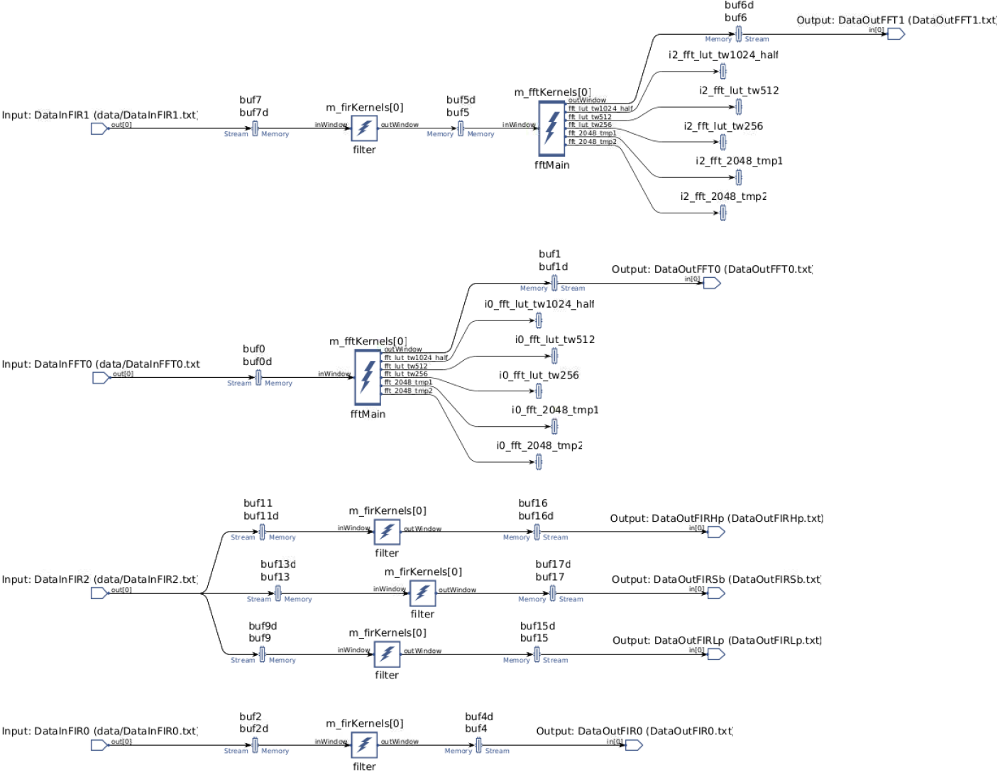

# DSP Library Lab

## Introduction

## Goal

- Use the DSP Vitis Libraries for the AI Engine

## Design Overview

### AI Engine Kernels

For the AI Engine kernel we will use the [FFT/iFFT](https://docs.xilinx.com/r/en-US/Vitis_Libraries/dsp/user_guide/L2/func-fft.html) as well as the [single rate, symmetrical](https://docs.xilinx.com/r/en-US/Vitis_Libraries/dsp/user_guide/L2/func-fir-filters.html) FIR filter from the DSP Libraries.


The templated parameters for the 1D FFT are defined [here](https://docs.xilinx.com/r/en-US/Vitis_Libraries/dsp/rst/class_xf_dsp_aie_fft_dit_1ch_fft_ifft_dit_1ch_graph.html_0)

The templated parameters for the symmetrical FIR filter are defined [here](https://docs.xilinx.com/r/en-US/Vitis_Libraries/dsp/rst/class_xf_dsp_aie_fir_sr_sym_fir_sr_sym_graph.html)

## Steps

This lab will make use of [Makefile](https://www.gnu.org/software/make/manual/make.html) files to automate the building process.

### AIE Engine Graph

The FFT kernel depends in the [Vitis Library](https://github.com/Xilinx/Vitis_Libraries) repository.

1. Make sure Vitis Libraries repository is downloaded

   ```sh
   cd $HOME/xup_aie_training/
   git submodule init && git submodule update
   ```

1. Navigate to the `$HOME/xup_aie_training/sources/dsplib_lab/aie` folder and run make

   ```sh
   cd $HOME/xup_aie_training/sources/dsplib_lab/aie
   make
   ```

   The `aiecompiler` will be called to generate the `libadf.a` file. This process takes around 5 minutes.

   Note: you can run `make -n` to see what command will be run without actually executing anything

1. Analyze the compilation results

   ```sh
   vitis_analyzer build.hw/work/graph.aiecompile_summary
   ```

1. In Vitis Analyzer, open the Graph tab

   

   Note that the Flat view is used

1. Questions for the reader by just looking at the information on Vitis Analyzer

   - Q1: How many `input_plio` does the graph have?

   - Q2: How many `output_plio` does the graph have?

   - Q3: How many instances of the `xf::dsp::aie::fir::sr_sym::fir_sr_sym_graph` does the graph have?

   - Q4: How many instances of the `xf::dsp::aie::fft::dit_1ch::fft_ifft_dit_1ch_graph` does the graph have?

   - Q5: One `input_plio` port is broadcasted, how many kernels are connected to it?

   - Q6: How many subgraphs are within the main graph?

   - Q7: How many Tiles are used for AIE Kernels?

   - Q8: How many Tiles are used for Buffers?

   - Q9: How many Tiles are used for Stream Interconnect?

1. Explore the files in the directory `$HOME/xup_aie_training/sources/dsplib_lab/aie/src/`

   - `fft.hpp` declares a graph `FFT1d_graph` which instantiates the FFT function `xf::dsp::aie::fft::dit_1ch::fft_ifft_dit_1ch_graph`

   - `fir.hpp` declares a graph `FIR_129_sym` which instantiates the FIR function `xf::dsp::aie::fir::sr_sym::fir_sr_sym_graph` it also declares four different set of taps. Note as we are using a symmetrical filter we only need to declare half of the coefficients plus the central tap

   - `graph.hpp` declares the main graph `DSPLibGraph`. There is also the declaration of `SpectrumGraph`, which connects an fir with an fft instance. Finally, the declaration of `MultiFIRGraph` which instantiates three `FIR_129_sym` graph an initializes the tap values via an initialization list

   - `graph.cpp` defines the emulation environment

   In an AMD preconfigured instance you can run `code $HOME/xup_aie_training/sources/dsplib_lab/aie/src/` to open the files with VS Code

### Run AIE Emulation

1. Run the AIE Emulation by executing the following code on the command line:

   ```sh
   make aieemu
   ```

   This AIE emulation takes around 3 minutes.

   Note: the AIE output results are not being checked

1. Visualize the emulation reports by running

   ```sh
   vitis_analyzer build.hw/aiesimulator_output/default.aierun_summary
   ```

1. Questions for the reader by just looking at the information on Vitis Analyzer

   - Q10: How many cycle does one instance of the FIR takes to complete?

   - Q11: How many cycle does one instance of the FTT takes to complete?

### Modify the Cascade Length

In this part we are going to modify the cascade length for both the FFT and FIR instances and see the changes in the graph and performance.

In an AMD preconfigured instance you can run `code $HOME/xup_aie_training/sources/dsplib_lab/aie/src/` to open the files with VS Code

1. Open the file `$HOME/xup_aie_training/sources/dsplib_lab/aie/src/fir.hpp` and change the macro `FIR129_CASCADE_LEN` to

   ```c++
   #define FIR129_CASCADE_LEN 2
   ```

1. Open the file `$HOME/xup_aie_training/sources/dsplib_lab/aie/src/fft.hpp` and change the macro `FFT_CASCADE_LEN` to

   ```c++
   #define FFT_CASCADE_LEN 2
   ```

1. Save previous compilation results

   ```sh
   cd $HOME/xup_aie_training/sources/dsplib_lab/aie
   mv build.hw/ build_no_cascade.hw/
   ```

1. Recompile the AIE code

   ```sh
   cd $HOME/xup_aie_training/sources/dsplib_lab/aie
   make
   ```

1. Analyze the compilation results

   ```sh
   vitis_analyzer build.hw/work/graph.aiecompile_summary
   ```

1. In Vitis Analyzer, open the Graph tab

   

   Note only a portion of the graph is shown.

   From this view, you can see that now the FIR instance is split in two kernels, which communicate using both a cascade interface and a buffer. Whereas, the FFT instance is also split in two kernels and these two kernels communicate using only a buffer.

### Run AIE Emulation for Cascaded Kernels

1. Run the AIE Emulation by executing the following code on the command line:

   ```sh
   make aieemu
   ```

   This AIE emulation takes around 3 minutes.

   Note: the AIE output results are not being checked

1. Visualize the emulation reports by running

   ```sh
   vitis_analyzer build.hw/aiesimulator_output/default.aierun_summary
   ```

1. Questions for the reader by just looking at the information on Vitis Analyzer

   - Q12: How many cycle does one instance of the FIR takes to complete?

   - Q13: How many cycle does one instance of the FTT takes to complete?

<!-- TODO
### Location Constraints

In this part we are going to specify constraints to map kernels to particular Tiles.

1. Make sure `FIR129_CASCADE_LEN` and `FFT_CASCADE_LEN` are set to 1

   ```sh
   cd $HOME/xup_aie_training/sources/dsplib_lab/aie/
   git checkout src/fir.hpp src/fft.hpp
   ```

1. Open the file `$HOME/xup_aie_training/sources/dsplib_lab/aie/src/graph.hpp` and uncomment the code around line 42

   ```c++
   location<kernel>(fir_lp) = tile(25,2);
   location<kernel>(fir_hp) = tile(20,2);
   location<kernel>(fir_sb) = tile(20,0);
   ```

1. Recompile the AIE code

   ```sh
   make clean; make
   ```

-->

<!-- TODO
### Build HW

The xclbin container is build via a Makefile flow.

1. Build hardware by running

   ```sh
   cd $HOME/xup_aie_training/sources/dsplib_lab/
   make
   ```
   
   The compilation takes around 80 minutes.

### Run

After the compilation is done, navigate to the host folder to execute the application.

```sh
cd $HOME/xup_aie_training/sources/dsplib_lab/host
./dsplab.exe
```

Note that at this point, the host code is not initializing the input samples, and therefore the used data is random.

-->

## Appendix

### Answers

- Q1: The graph has four `input_plio`

- Q2: The graph has six `output_plio`

- Q3: The graph has five `xf::dsp::aie::fir::sr_sym::fir_sr_sym_graph` instances

- Q4: The graph has two `xf::dsp::aie::fft::dit_1ch::fft_ifft_dit_1ch_graph` instances

- Q5: The input `input_plio` port `DataInFIR2` is broadcasted to three instances of `xf::dsp::aie::fir::sr_sym::fir_sr_sym_graph`

- Q6: There are two subgraphs: `SpectrumGraph` and `MultiFIRGraph`. The `fft` and `fir` graph are subgraph but not defined by our code

- Q7: 7 tiles are used for AIE Kernels

- Q8: 15 tiles are used for Buffers

- Q9: 19 Tiles are used for Stream Interconnect?

- Q10: Looking at the Profile tab, the function `filter` takes  ~ 11,183 cycles

- Q11: Looking at the Profile tab, the function `fftMain` takes  ~ 3,411 cycles

- Q12: With a cascade length of 2, the FIR is split into two kernels one `filter` instance takes  ~ 7,336 cycles whereas the another takes ~ 8,7510 cycles. Bare in mind, that these two instances run in parallel

- Q13: With a cascade length of 2, the FFT is split into two kernels one `fftMain` instance takes  ~ 1,785 cycles whereas the another takes ~ 1,657 cycles. Bare in mind, that these two instances run in parallel

---------------------------------------
<p align="center">Copyright&copy; 2023 Advanced Micro Devices</p>