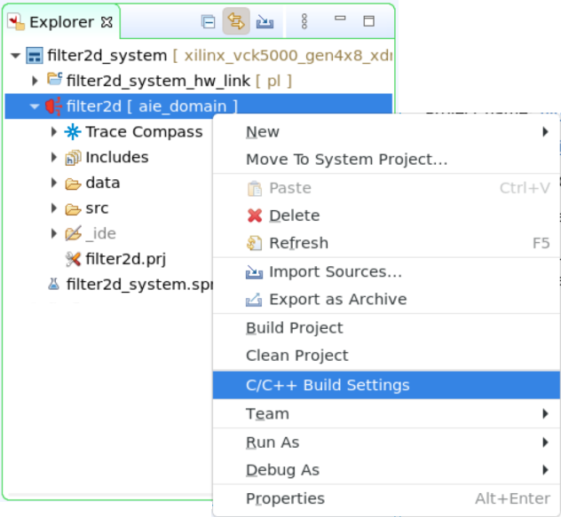
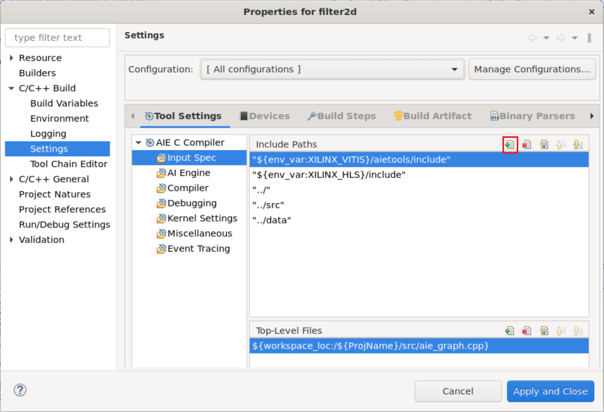
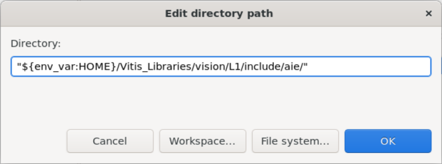
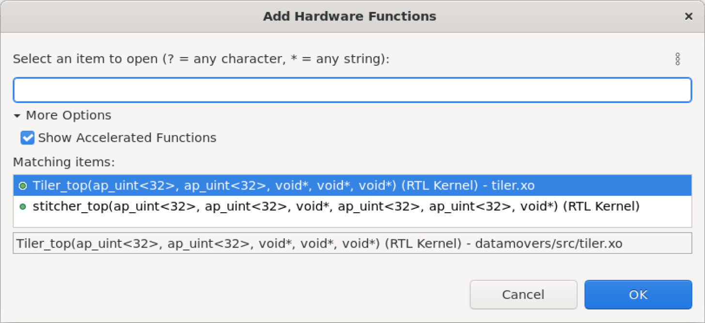

# Filter2D lab

Coming soon

<!--

TODO

## Introduction

This lab guides you through the steps involved in creating a filter 2D using the AIE vision libraries.
### References

[Vitis AIE Design Methodology](https://docs.xilinx.com/r/en-US/Vitis_Libraries/vision/overview-aie.html_1_1)

## Description of the lab

Based on https://github.com/Xilinx/Vitis_Libraries/tree/master/vision/L2/tests/aie/Filter2D/16bit_aie_8bit_pl

In this lab we are going to implement a [Filter2D](https://en.wikipedia.org/wiki/Kernel_(image_processing)) in an image, with a combination of kernels in the PL and AIE.

Concepts:

- Vitis Libraries

## Objectives of this lab

After completing this lab, you will learn to

- Use the Vitis Libraries from the GUI
- Run AI Engine software simulation
- Run AI Engine software emulation
- Run hardware

## Steps

### Clone Vitis Libraries

1. Get Vitis Library 2022.2 version

   ```sh
   git clone https://github.com/Xilinx/Vitis_Libraries.git -b v2022.2_update1 ~/Vitis_Libraries
   ```

   This will clone the libraries in your user.

### Create a Vitis Project for the VCK5000 Versal Development Card

1. In the Vitis GUI create a new application project

   * Platform: xilinx_vck5000_gen4x8_qdma_2_202220_1
   * Name: filter2d
   * Processor: ai_engine
   * Domain: ai_engine
   * Acceleration templates: Empty Application

### Add source code for the AI Engine domain

1. In the Explore pane, right-click `filter2d [ aie_domain ]`, then select *Import Sources...*

1. In the Import Source window, click *Browse...*, then navigate to `$HOME/xup_aie_training/sources/filter2d_lab/aie_domain` and click *Open*.

1. Tick the *aie_domain* box, then update the field *Into folder:* **filter2d**

1. In the Explore pane, expand `filter2d [ aie_domain ] > data` and `filter2d [ aie_domain ] > src`

   Review the source files

1. In the Explore pane, double-click `filter2d [ aie_domain ] > filter2d.prj`

1. In the Application Project Settings window, select the *Top-Level File*

1. In the File selection window, expand `filter2d > src` and select **aie_graph.cpp**, then click *OK*

### Include path to Vitis Libraries

1. In the Explore pane, right-click `filter2d [ aie_domain ] > filter2d.prj`, then select *C/C++ Build Settings*

   

1. Make sure *Configuration: [ All Configurations ]*

1. In the *AIE C Compiler Window*, select *Input Spec*

1. Then, click *Add...*

   

1. In the directory path, type the following
   
   ```
   "${env_var:HOME}/Vitis_Libraries/vision/L1/include/aie/"
   ```

   

1. Click *OK*, then *Apply and Close*

### Compile AI Engine kernel for Software Emulation

We are going to compile the AI Engine kernel and run software emulation to verify code correctness.

1. In the Application Project Settings window, set the active build configuration *Emulation-SW*

1. In the Explore pane, right-click on `filter2d [ aie_domain ]` and then select *Build Project*

### Run SW Emulation - x86 Simulation

Software emulation (x86 Simulation) uses the files in the data folder as stimuli. We will get an output file with the results.

1. In the Explore pane, right-click on `filter2d [ aie_domain ]` and then select *Run As > Launch SW Emulator*.

1. Once the simulation is completed, in the Explore pane, select at the same time both `filter2d [ aie_domain ] > Emulation-SW > x86simulator_output > data > output.txt` and `filter2d [ aie_domain ] > data > golden.txt`. Then, right-click on one of them and select *Compare With > Each Other After Transformation*

1. In the *Extra transformation commands* window, enter the following command to remove timestamps and to remove the extra spaces, then click *OK*

   ```console
   grep -v T {0} | sed "s/^[ \t]*//"  | sed "s/[ ^t]*$//" > {0}2 && mv {0}2 {0}
   ```

1. A window reporting no differences pops up, click *OK* to continue

### Compile and run AIE Simulation

This is still a software emulation (AIE Simulation), however the simulation takes into account the actual AI Engine array architecture. The AIE Simulation also uses files as input/outputs.

1. In the Application Project Settings window, set the active build configuration *Emulation-AIE*

1. In the Explore pane, right-click on `filter2d [ aie_domain ]` and then select *Build Project*

   This compilation takes around 3-4 minutes

1. In the Explore pane, right-click on `filter2d [ aie_domain ]` and then select *Run As > Launch AIE Emulator*

   The simulation takes around 4-5 minutes

1. In the Explore pane, select at the same time both `filter2d [ aie_domain ] > Emulation-AIE > aiesimulator_output > data > output.txt` and `filter2d [ aie_domain ] > data > golden.txt`. Then, right-click on one of them and select *Compare With > Each Other After Transformation*

1. In the *Extra transformation commands* window, enter the following command to remove timestamps and to remove the extra spaces, then click *OK*

   ```console
   grep -v T {0} | sed "s/^[ \t]*//"  | sed "s/[ ^t]*$//" > {0}2 && mv {0}2 {0}
   ```

1. A window reporting no differences pops up, click *OK* to finish

## Conclusion

In this lab, you used one of the vision functions available in the Vitis Libraries to implement a Filter2D in an AI Engine. You ran both x86 and AIE simulation.

## Appendix
### Build for hardware

#### Add Hw Kernel Project

1. In the Explore pane, right-click `filter2d_system` and select *Add Hw Kernel Project...*

1. In the New Vitis IDE Project window, enter `datamovers` as *Hw Kernel project name:*, then click *Finish*

1. Right-click on the new created `datamovers > src` folder, then select `Import Sources...`

1. In the Import Source window, click *Browse...*, then navigate to `~/Vitis_Libraries/vision/L1/lib/hw/8_16/` and click *Open*.

1. Tick the *8_16* box, then update click *Finish*

   Make sure the *Into folder: datamovers/src*

1. In the Explore pane, double-click `datamovers.prj`

1. In the Hardware Kernel Project Settings, click the `Add Hardware Function...` button

1. In the Add Hardware Function window, select both Tiler_top and stitcher_top *OK*

   

   If the functions are not visible, expand *More Options* and tick *Show Accelerated Functions*

### Add kernel linking file

We need to specify how the streaming interfaces of our kernels are going to be connected to the AI Engine array.

1. In the Explore pane, right-click on `filter2d_system_hw_link`, then select *Import Sources...*

1. In the Import Source window, click *Browse...*, then navigate to `$HOME/xup_aie_training/sources/filter2d_lab/hw_link` and click *Open*.

1. Tick the *hw_link* box

1. Enter **filter2d_system_hw_link/** in the *Into folder:* field, then click *Finish*

1. In the Explore pane, double-click `filter2d_system_hw_link > filter2d_system_hw_link.prj`

1. Right-click on the binary_container_1, and select *Edit V++ Options...*

1. In the `V++ command line options`: add `--config ../system.cfg` then click *Apply and Close*

### Add host code and configure compile options

1. In the Explore pane, right-click `filter2d_system` and select *Add Application Project...*

1. In the New Vitis IDE Project window, enter `host_x86` as *Application project name:*, select the x86 SMP processor and finally click *Next >*

1. In the Template window, select `Empty Application` then click *Next >*

1. In the Explore pane, right-click on `host_x86`, then select *Import Sources...*

1. In the Import Source window, click *Browse...*, then navigate to `$HOME/xup_aie_training/sources/filter2d_lab/x86` and click *Open*.

1. Tick the *x86* box, then click *Finish*

1. In the Explore pane, right-click on `host_x86 [x86]`, then select *C/C++ Build Settings...*

1. Select All configurations and add dialect flag, `-std=c++17`

1. Select `GCC Host Compiler (x_86_64) > Includes`, click `Add..`

   Add the `${env_var:XILINX_VITIS}/aietools/include/`

   ${env_var:HOME}/Vitis_Libraries/vision/L1/include/aie/

   ${env_var:XILINX_VITIS}/aietools/include/drivers/aiengine/

1. Select `GCC Host Compiler (x_86_64) > Miscellaneous`, add the following to Other flags

   `\`pkg-config --cflags --libs opencv4\``

1. Select `GCC Host Linker (x_86_64) > Libraries`

   Add the following libraries, under Libraries (-l)

   `adf_api_xrt`

   `xrt_coreutil`

   `uuid`

   Add the following path, under search path (-L)

   `${env_var:XILINX_VITIS}/aietools/lib/lnx64.o`

1. Finally, click *Apply and Close*

Note: OpenCV **4.4.0** needs to be installed in your system, instructions [here](install_opencv.md) 

### Build hardware Accelerator

1. In the Explore pane, double-click on `filter2d_system.sprj`

1. Select *Hardware* as the active build configuration

1. In the Explore pane, right-click on the `filter2d_system` then select *Build Project*

   This process takes around 60 minutes.

-->

---------------------------------------
<p align="center">Copyright&copy; 2023 Advanced Micro Devices</p>
