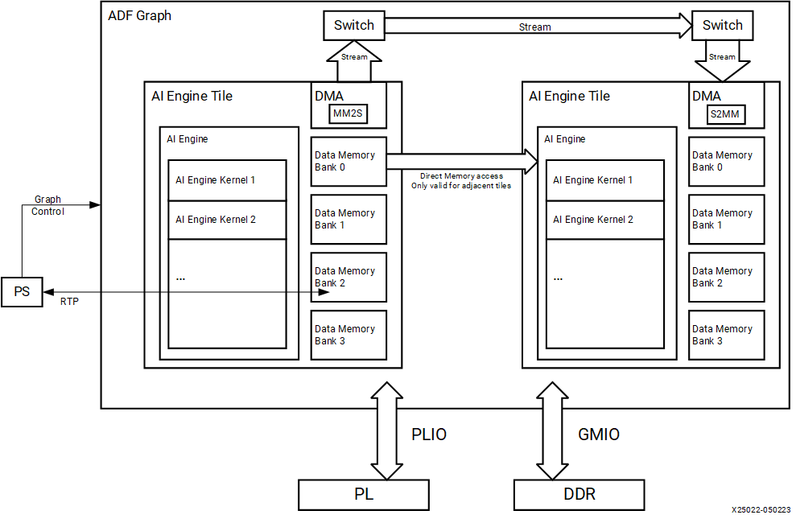
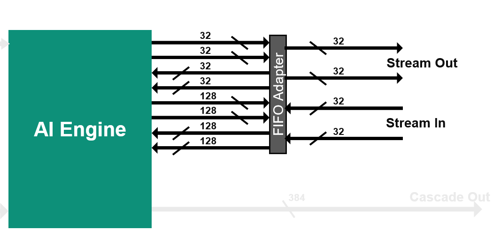
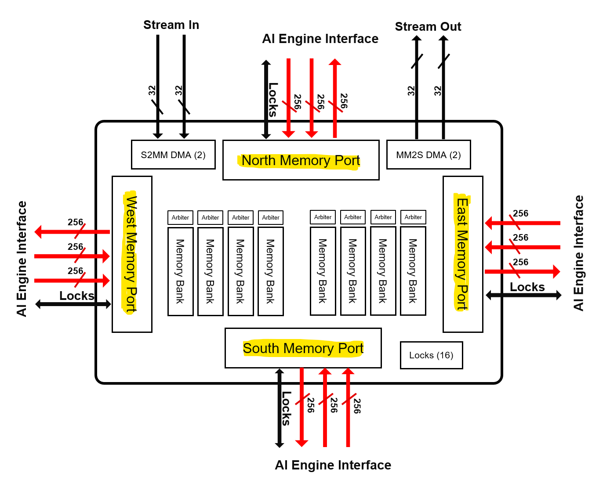
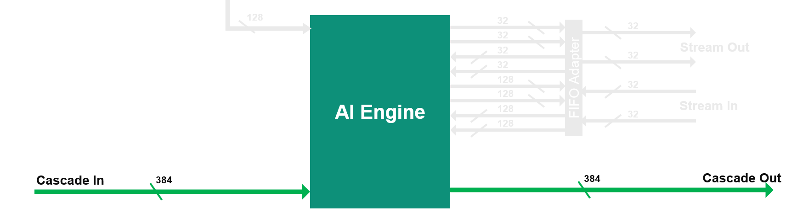
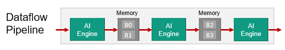
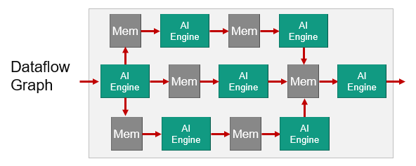
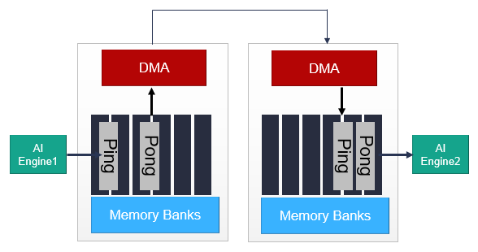
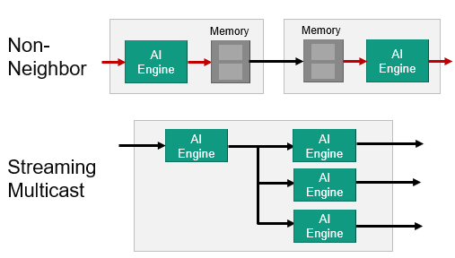

# AI Engine Communication Project Based Example -- Multiple Kernel Programming

## Background

While single kernel programming focuses on vectorization of algorithm in a single AI Engine, multiple kernel programming considers several AI Engine kernels with data flowing between them. An adaptive data flow (ADF) graph application consists of nodes and edges where nodes represent compute kernel functions, and edges represent data connections. Kernels in the application can be compiled to run on the AI Engines, and are the fundamental building blocks of an ADF graph specification. The ADF graph is a modified Kahn process network with the AI Engine kernels operating in parallel. AI Engine kernels operate on data streams. These kernels consume input blocks of data and produce output blocks of data. Kernel behavior may be modified using static data or runtime parameter (RTP) arguments that can be either asynchronous or synchronous. The ADF graph can contain a single kernel or multiple kernels interacting with PS, PL, and global memory.



When programming for the AI Engine, it is important to note that each AI Engine has the capability to access one 32-bit AXI4-Stream input, one 32-bit AXI4-Stream output, one 512-bit cascade stream input (coming from north or west), one 512-bit cascade stream output (going to south or east), two 256-bit data loads, and one 256-bit data store. However, due to the length of the instruction, not all of these operations can be performed during the same cycle.

Each AI Engine kernel has a runtime ratio. This number is computed as a ratio of the number of cycles taken by one invocation of a kernel (processing one block of data) to the cycle budget. The cycle budget for an application is typically fixed according to the expected data throughput and the block size being processed. The runtime parameter is specified as a constraint for every AI Engine kernel in the ADF graph. The AI Engine compiler allocates multiple kernels into a single AI Engine if their combined total runtime ratio is less than one and multiple kernels fit in the AI Engine program memory, and if the total resource usage, like stream interface number, does not exceed the AI Engine tile limit. Alternatively, the compiler can allocate them into multiple AI Engines.

## Goal

To optimally use hardware resources, it is critical to understand the different methods available to transfer data between the ADF graph and PS, PL, and global memory, transfer data between kernels, balance the data movement, and minimize memory or stream stalls as much as possible.

## Objectives

This lab guides you through the steps involved in creating single FIR kernel using stream and memory interface and modify the connectivity by graph and runtime ratio to add multiple kernels with different interfaces. You will simulate and emulate the project. Finally, you will run the lab on real hardware.

1. Review and firmly grasp some basic concepts on AIE stream and memory interface and data movement
2. Creating single FIR kernel using stream and memory interface
3. Modify connectivity to add two kernels connected with memory interface
4. Modify connectivity to add two kernels connected with cascade stream interface

## Catalog

| lab | Interface   |  Connection   | Placement| DataType | Samples |
|--------|---------|----------|--------------|--------|--------|
|  [fir_stream_memory](https://github.com/Xilinx/xup_aie_training/blob/main/pbl/aie_multi_kernel/fir_interconnect/fir_stream_memory/notebook/fir_s_m.ipynb) | Stream or Memory Interface | /  |/| int16 | 1024 |
|  [fir_m2m](https://github.com/Xilinx/xup_aie_training/blob/main/pbl/aie_multi_kernel/fir_interconnect/fir_m2m/notebook/fir_m2m.ipynb) | Memory | Shared Memory Using Memory Interface  | neighbor |int16 | 1024 |
|  [fir_cascade](https://github.com/Xilinx/xup_aie_training/blob/main/pbl/aie_multi_kernel/fir_interconnect/fir_cascade/notebook/fir_cascade.ipynb) | Stream | AXI4-Stream Interconnect Using Cascade Stream Interface |neighbor | int16 | 1024 |

## Steps

This lab will use Makefile files to automate the building process.

### step 1: Build the AIE Component and Run the AIE Emulation

1. Navigate to the AIE folder and run make all to build the HLS kernel project

   ```sh
   cd $HOME/xup_aie_training/pbl/fir_stream_memory/prj/aie
   make all
   ```

2. Run the AIE Emulation

   ```sh
   make aieemu
   ```

3. Analyze the AIE Emulation and compilation results

   ```sh
   make analyzer
   ```

4. Get the AIE Emulation result

   ```sh
   make get_output
   ```

   The output files can be found here: `$HOME/xup_aie_training/pbl/fir_stream_memory/prj/aie/data/output_aie.txt`

### Step 2: Run the FIR Application in the Juypter Notebook

1. Navigate to the notebook folder and run the mean filter application to validate the AIE Emulation result.

   ```sh
   code $HOME/xup_aie_training/pbl/fir_stream_memory/notebook/
   ```

   Run all the cells

### Step 3: Build the Whole Application for Hardware Run (optional)

1. Build for hardware targets and generate the FPGA binary (.xclbin file) and host executable, which includes build the PL kernels and integrate the PL kernels and AIE kernels together in the VCK5000 platform. 

   ```sh
   cd $HOME/xup_aie_training/pbl/fir_stream_memory/prj
   make all
   ```

   - Note:This step can take a couple of hours, or more significant time depending on the design complexity, the machine you are building on, and its current workload.

2. Run the application on a system with the AMD VCK5000 card using the following command

   ```sh
   cd $HOME/xup_aie_training/pbl/fir_stream_memory/prj/host
   ./fir_s_m.exe ../build.hw/fir_s_m.xclbin
   ```

3. Check the hardware output file

   ```terminal
   $HOME/xup_aie_training/pbl/fir_stream_memory/prj/host/output.txt
   ```

## Review and Understand Key Concepts

### AI Engine Stream and Memory Interface

### 1. Stream Interface

The streaming interface is based on two incoming streams and two outgoing streams, each one on 32 bits per clock cycle. These four streams are handled by a stream FIFO that allows the processor to use different bit widths to access these streams:

- 2 streams in, 2 streams out:
  - Each one 4 bytes/cycle or 16 bytes/ 4 cycles
- Parallel access to streams per VLIW:
  - 2 reads (4/16 bytes), 1 write (4/16 bytes)
  - OR 1 read (4/16 bytes), 2 writes (4/16 bytes)
- Using 1 stream:
  - 4 bytes/cycle read and 4 bytes/cycle write
- Using the 2 streams and the 16-byte access option:
  - Reads and/or writes can be dispatched over time
  - On an average 8 bytes/cycle read and 8 bytes/cycle write

Accessing the data to/from the streams using the 128-bit interface does not increase the bandwidth, but limits the number of accesses that must be scheduled within the microcode of the VLIW processor.



### 2. Memory Interface

Each AI Engine is surrounded by 4x 32 kB data memories, each one being divided in four pairs of banks. The bandwidth is high:

- 2 reads / cycle on 32 bytes (256 bits) each
  - Each bank has a single port, the accesses must be done on different banks to achieve 2x 256 bits/cycle.
- 1 write / cycle on 32 bytes (256 bits)
  - On another bank to achieve the highest bandwidth.

- Be aware that you need also to feed the memories using DMAs or other AI Engines.



### 3. Cascade Streams

The cascade stream allows an AI Engine processor to transfer the value of some of its accumulator register (384 bits) to its neighbor (on the left or right depending on the row):

It is capable of 8x 48-bit word transfer 8x acc48 or 4x complex acc48 in a single cycle.
48 bits is the number of bits of the result of a 16 bits x 16 bits multiplication.
If the transfer concerns a 768-bit register, it takes 2 clock cycles.



### Interface Considerations - Stream Vs Memory

1. Stream

Each stream is a 32-bit input and 32-bit output interface and has a throughput of 32 Gb/s (2 streams per AI Engine core). Stream can be accessed with a 32-bit write/reads or a 128-bit write/reads every 4 cycles. One of the biggest advantage of streams is a flexibility in routing, where data can be streamed to multiple cores at the same time. In addition, streams do not require extensive buffering, as a result stream designs offer much reduced latency.

2. Memory

Memory input is a 256-bit interface to one of the surrounding memory banks - with a potential input bandwidth: 256 Gb/s. Maximum bandwidth is higher than the stream Interface, but memory needs to be fed with data coming from other cores or a PL.There's potential memory conflict hazards when 2 neighboring cores try to access same memory bank.

Memory module offers 32kB of storage per AI Engine core tile. Although, AIE tiles can access neighboring memory Modules, its size needs to be taken into account while defining the architecture, e.g. if a single AI Core fully utilizes all its available memory - 128 kB, neighboring tiles may essentially be rendered unusable with no storage available for data and/or stack.

Memory interface requires data synchronization through ping-pong buffers, where part of the buffer is being operated on while other part is being fed with new data. This doubles the requirement for data storage.In addition, memory Module interface is only connected to neighboring cores, which limits accessibility to data from multiple cores.

3. Consideration

The mechanism of data access is the most critical aspect in whether to use the memory interface or the stream interface.
For memory interface，the kernel can perform random access within a buffer of data and there is the ability to specify a margin for algorithms that require some number of bytes from the previous buffer. For stream interface, it is used for continuous data and using blocking or non-blocking calls to read and write in a sample-by-sample fashion.

## AI Engine Data Movement Architecture

### 1. AIE to AIE Data Communication via Shared Memory Using Memory Interface

The dataflow pipeline is very simple which simply compute in the core and store in local memory. That memory can be accessed from a neighbor core. And continue as such through the array. Very simple standard dataflow pipeline using the shared memory.



The dataflow graph is a bit more complex. So here you can see a core writing into more than one of the shared memories it can access. Then that data can be processed in parallel in multiple dataflow paths as the pipeline is shown.



**Note:** The AIE to AIE data communication via shared memory methods are dealing with neighboring cores. But if you need to communicate with non-neighboring cores you can send your data through the streaming non-blocking interconnect. This use the data movers (DMAs) integrated in the tiles to achieve this.

### 2. AIE to AIE Data Communication via Memory and DMA

For non-neighboring AI Engine tiles, a similar communication can be established using the DMA in the memory module associated with each AI Engine tile, as shown here.



The synchronization of the ping-pong buffers in each memory module is carried out by the locks in a similar manner to the process with AI Engine to AI Engine data communication via shared memory. The main differences are increased communication latency and memory resources.

### 3. AIE to AIE Data Communication via AXI4-Stream Interconnect Using Memory and Stream Interface

Another non-neighbor communication scheme which we call the Streaming Multicast. This is used a lot in machine learning with the same data can be sent to multiple cores all over the array as needed and compute can happen in parallel. AI Engines can directly communicate through the AXI4-Stream interconnect without any DMA or memory interaction.



As shown in the figure, data can be sent from one AI Engine to another through the streaming interface in a serial fashion, or the same information can be sent to an arbitrary number of AI Engine tiles using a multicast communications approach. The streams can go in north/south and east/west directions. In all the streaming cases, there are built-in handshake and back pressure mechanisms. This should give you a feel for how data is moved around the array and the available options. Although it is important to understand these, the tools will configure all of this for you. You do not need to program DMAs or the interconnect network.

To achieve required performance, kernels can be split and run on multiple AI Engines. Use the cascade stream to transfer the intermediate accumulation result from one AI Engine (or kernel) to the next AI Engine (or kernel). The cascade stream is highlighted in green. A cascade stream connects the AI Engines in the array in a chain and allows the AI Engines to transfer an accumulator register (384 bits) from one to the next. A small two-deep 384-bit wide FIFO on both the input and output streams allows storing up to four values in the FIFOs between the AI Engines. For example, split a filter across multiple engines as needed half the coefficient to 2 of the AI Engines.

## AI Engine Run-Runtime Ratio

The run-time ratio is a parameter with a value between 0 and 1 which should be defined for all of the kernels in a graph. It defines, as a percentage value, how much of the processing time of a single AI Engine core is required by the kernel.

For example, a run-time value of 0.5 means that the kernel only needs 50% of the processing time of one AI Engine core.Depending on the run-time ratios of the kernels, one kernel or multiple kernels can be mapped onto one AI Engine.

### 1. Computing the run-time ratio for a kernel

The run-time ratio of a kernel can be computed using the following equation:

run-time ratio = (cycles for one run of the kernel)/(cycle budget)

The cycle budget is the number of instruction cycles a kernel can take to either consume data from its input (when dealing with a rate limited input data stream), or to produce a block of data on its output (when dealing with a rate limited output data stream).

It is defined by the following equation:

```
Cycle Budget = Block Size * (AI Engine Clock Frequency/Sample Frequency)
```

For example, take a kernel which processes a window of 128 samples and the input samples frequency (for example from an ADC) is 245.76MHz. The cycle budget is 128*(1000/245.76) = 520 cycles.

This means that with the AI Engine Array running at 1GHz, the kernel needs to be executed in less than 520 AI Engine clock cycles (because the next input window would be ready after 520 clock cycles).

### 2. Impact of the Run-time ratio on kernel mapping and resource utilization

1. Increasing the run-time ratio to get 1 kernel per core might not increase the performances of the graph as it might be limited by the input or output throughput. Thus, having a run-time ratio higher than required might result in inefficient use of the resources.

2. Reducing the run-time ratio might not always result in a reduction of the resource utilization as the compiler will map the kernels to the same core only when it makes sense. For example, here the 2 kernels are communicating together through a memory. Thus, they are already dependant on each other as the second kernel cannot start processing the data while the other has not completed its execution.

---------------------------------------
<p align="center">Copyright&copy; 2023 Advanced Micro Devices</p>
