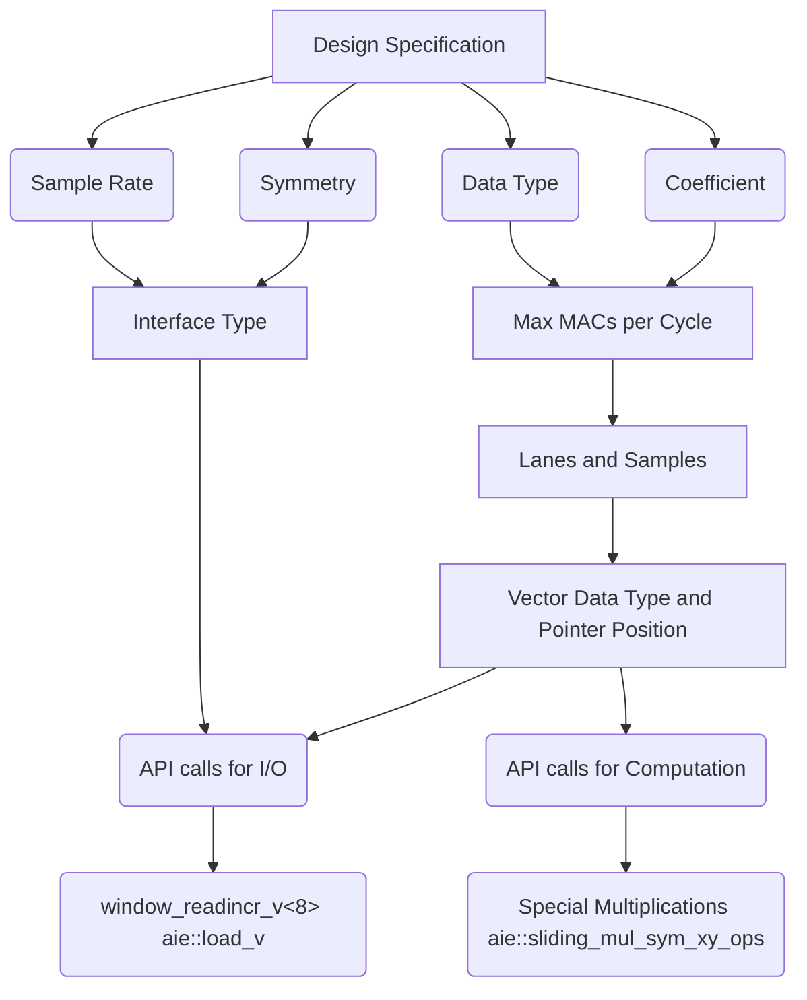

# Low-order FIR Filter Project Based Learning -- Single Kernel Programming

The Versal™ AI Engines (AIE) are well suited for vector math operations. One specific application that is worthy of consideration is low-order FIR filters. 
For low-order symmetric and asymmetric FIR structures a single AIE can implement multiple filters, each running at the AIE clock rate which can be 1 GHz or more.

This lab provides the entire process of designing a low-pass filter using Python in a Jupyter notebook environment and deploying it to an AIE, showcasing the filtered results. This lab provides guidelines for coding such a filter in the Vitis™ AI Engine tools: for the experienced programmer it provides a structured approach to code low-order FIR filters. For learners it also provides background of key concepts such as AIE vectors, AIE APIs, and data flow.

The tutorial is divided into three parts. The first part shows the whole process of designing a low-pass filter and verifying it using Python.
The second part focus on the Single Kernel Programming using the AIE APIs to achieve the highest performance on the AI Engine. The primary goal of single kernel programming is to ensure the use of the vector processor approaches its theoretical maximum. Vectorization of the algorithm is important, but managing the vector registers, memory access, and software pipelining are also required. The third part goes through the steps on creating the ADF graph and analyze the performance. The following table shows the key content of the three parts of the tutorial.

<table border="2">
<thead>
  <tr>
    <th>Part</th>
    <th>Topic</th>
    <th>Description</th>
  </tr>
</thead>
<tbody>
  <tr>
    <td rowspan="3">1</td>
    <td rowspan="3"><a href="https://github.com/Xilinx/xup_aie_training/blob/main/pbl/aie_single_kernel/fir_lowpass/notebook/fir_lowpass1.ipynb">Software implementation</a></td>
    <td>Demonstrate the software implementation of the application</td>
  </tr>
  <tr>
    <td>Using Python and its powerful extensible library</td>
  </tr>
  <tr>
    <td>Generate the input data and golden file for the AIE</td>
  </tr>
  <tr>
    <td rowspan="2">2</td>
    <td rowspan="2"><a href="https://github.com/Xilinx/xup_aie_training/blob/main/pbl/aie_single_kernel/fir_lowpass/notebook/fir_lowpass2.ipynb">Single Kernel Programming</a></td>
    <td>Design the FIR single kernel in AIE</td>
  </tr>
  <tr>
    <td>Analyze and optimize the read and write efficiency of ports</td>
  </tr>
  <tr>
    <td rowspan="3">3</td>
    <td rowspan="3"><a href="https://github.com/Xilinx/xup_aie_training/blob/main/pbl/aie_single_kernel/fir_lowpass/notebook/fir_lowpass3.ipynb">Graph Programming and Performance Analysis</a></td>
    <td>Create the kernel Graph and the test bench</td>
  </tr>
  <tr>
    <td>Compare with AIE HW Emulation result with the SW result</td>
  </tr>
  <tr>
    <td>Analyze performance and accuracy</td>
  </tr>
</tbody>
</table>

Single Kernel Programming Design Flow In Part 2

- Note: A basic understanding of FIR filters, C language, and the Xilinx® Vitis™ tools is assumed.

---------------------------------------

Copyright&copy; 2023 Advanced Micro Devices

