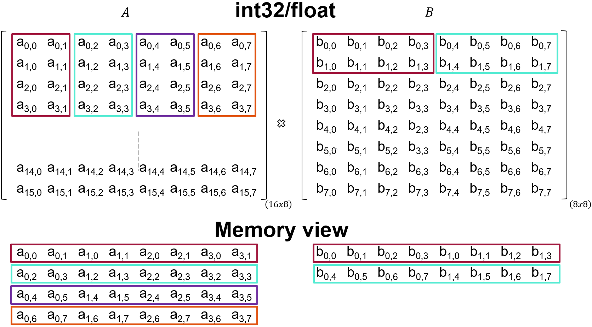

# Matrix Multiplication Source Code Description

This document describes the kernel code to compute the matrix multiplication of A(16,8) x B(8,8) for four different data types. We use a generic templated code that leverages the [AIE APIs](https://www.xilinx.com/htmldocs/xilinx2022_2/aiengine_api/aie_api/doc/index.html) to support this. Using such generic code allows us to write reusable code for the different data types as well as AIE architectures.

Before looking at each kernel in detail, it is important to highlight that we are going to use the [Matrix Multiplication API](https://www.xilinx.com/htmldocs/xilinx2022_2/aiengine_api/aie_api/doc/group__group__mmul.html) available from the AIE API.

## Matrix Multiplication

This section is only intended to provide context in order to understand the following sections. We all are familiar with matrix multiplication. The inner product of each row of the first matrix times each column of the second matrix produces one element of the result. This is shown in the following animation.

Animation coming soon


Matrix multiplication has a high computation intensity due to the number of required operations to compute the output result. Accelerating matrix multiplication is well covered in the literature both for CPU and [GPU](https://gitlab.com/syifan/hipbookexample/-/tree/main/Chapter5/MatrixMultiplication).

## Matrix Multiplication on the AI Engine Tile using the AIE API

In the remainder of this document, we cover how the matrix multiplication is performed in the AI Engine tile for 4 different data types

* float

* int32

* int16

* int8

We use a generic templated C++ code derived from the [Matrix Multiplication API](https://www.xilinx.com/htmldocs/xilinx2022_2/aiengine_api/aie_api/doc/group__group__mmul.html). You can find the code [here](https://github.com/Xilinx/xup_aie_training/tree/main/sources/matmult_lab/aie/src/aie_kernels/matmult_generic.h)

A snippet of the code can be found below:

```c++
template <unsigned M, unsigned K, unsigned N, typename T>
static void mmul_blocked(
    unsigned rowA, unsigned colA, unsigned colB, const T *__restrict A, const T *__restrict B, T *__restrict C)
{
    using MMUL = aie::mmul<M, K, N, T, T>;

    for (unsigned z = 0; z < rowA; z++) {
        for (unsigned j = 0; j < colB; j++) {
            unsigned i = 0;
            const T *a_ptr = A + (z * colA + i) * MMUL::size_A;
            const T *b_ptr = B + (i * colB + j) * MMUL::size_B;
            T       *c_ptr = C + (z * colB + j) * MMUL::size_C;

            auto block_a = aie::load_v<MMUL::size_A>(a_ptr);
            auto block_b = aie::load_v<MMUL::size_B>(b_ptr);

            MMUL block_c;
            block_c.mul(block_a, block_b);

            for (i = 1; i < colA; ++i) {
                a_ptr = A + (z * colA + i) * MMUL::size_A;
                b_ptr = B + (i * colB + j) * MMUL::size_B;

                block_a = aie::load_v<MMUL::size_A>(a_ptr);
                block_b = aie::load_v<MMUL::size_B>(b_ptr);

                block_c.mac(block_a, block_b);
            }

            aie::store_v(c_ptr, block_c.template to_vector<T>());
        }
    }
}
```

This code realizes the computation of A x B = C, where A is of the shape MxK; B is of the shape KxN and C is of the shape MxN. Please, refer to AIE API Matrix Multiply documentation to find out [supported shapes](https://www.xilinx.com/htmldocs/xilinx2022_2/aiengine_api/aie_api/doc/group__group__mmul.html#group_mmul_page_supported_shapes). This result would be typically smaller than the matrix size we want to compute, therefore we need to tile the matrices. The parameters `rowA`, `colA` and `colB` define the number of tiles in each dimension.

The templated parameters and arguments are defined below:

* M: number of rows in each tile of matrix A

* K: number of columns in each tile of matrix A and number of rows in each tile of matrix A and

* N: number of columns in each tile of matrix B

* T: data type

* rowA: number of tiles in the row dimension of matrix A

* colA: number of tiles in the column dimension of matrix A and number of tiles in the row dimension of matrix B

* colB: number of tiles in the column dimension of matrix B

* A: pointer to data of input matrix A

* B: pointer to data of input matrix B

* C: pointer to data of output matrix C

### Matrix Multiplication int32 and float

The call to the `mmul_blocked` for the data types int32 and float is shown below

```c++
void matmult_<int32|float>(input_window<int32> *__restrict matA,
                   input_window<int32> *__restrict matB,
                   output_window<int32> *__restrict matC) {
    mmul_blocked<2, 4, 4, int32>(F_Ra/2,
                                 F_Ca/4,
                                 F_Cb/4,
                                 reinterpret_cast<const int32 *>(matA->ptr),
                                 reinterpret_cast<const int32 *>(matB->ptr),
                                 reinterpret_cast<int32 *>(matC->ptr));
}
```

The shape MxKxN is 2,4,4 which means that the tile size for matrix A is 2x4 and for matrix B is 4x4. This means that the order in which data should be sent to the kernels is as follow:



### Matrix Multiplication int16

The call to the `mmul_blocked` for the data types int32 and float is shown below

```c++
void matmult_int16(input_window<int16> *__restrict matA,
                   input_window<int16> *__restrict matB,
                   output_window<int16> *__restrict matC){
    mmul_blocked<2, 4, 8, int16>(F_Ra/2,
                                 F_Ca/4,
                                 F_Cb/8,
                                 reinterpret_cast<const int16 *>(matA->ptr),
                                 reinterpret_cast<const int16 *>(matB->ptr),
                                 reinterpret_cast<int16 *>(matC->ptr));
}
```

The shape MxKxN is 2,4,8 which means that the tile size for matrix A is 2x4 and for matrix B is 4x8. This means that the order in which data should be sent to the kernels is as follow:


### Matrix Multiplication int8

The call to the `mmul_blocked` for the data types int32 and float is shown below

```c++
void matmult_int8(input_window<int8> *__restrict matA,
                  input_window<int8> *__restrict matB,
                  output_window<int8> *__restrict matC){
    mmul_blocked<4, 8, 8, int8>(F_Ra/4, F_Ca/8, F_Cb/8, matA->ptr, matB->ptr, matC->ptr);
}
```

The shape MxKxN is 4,8,8 which means that the tile size for matrix A is 4x8 and for matrix B is 8x8. This means that the order in which data should be sent to the kernels is the same as the matrices we are using:


---------------------------------------
<p align="center">Copyright&copy; 2023 Advanced Micro Devices</p>