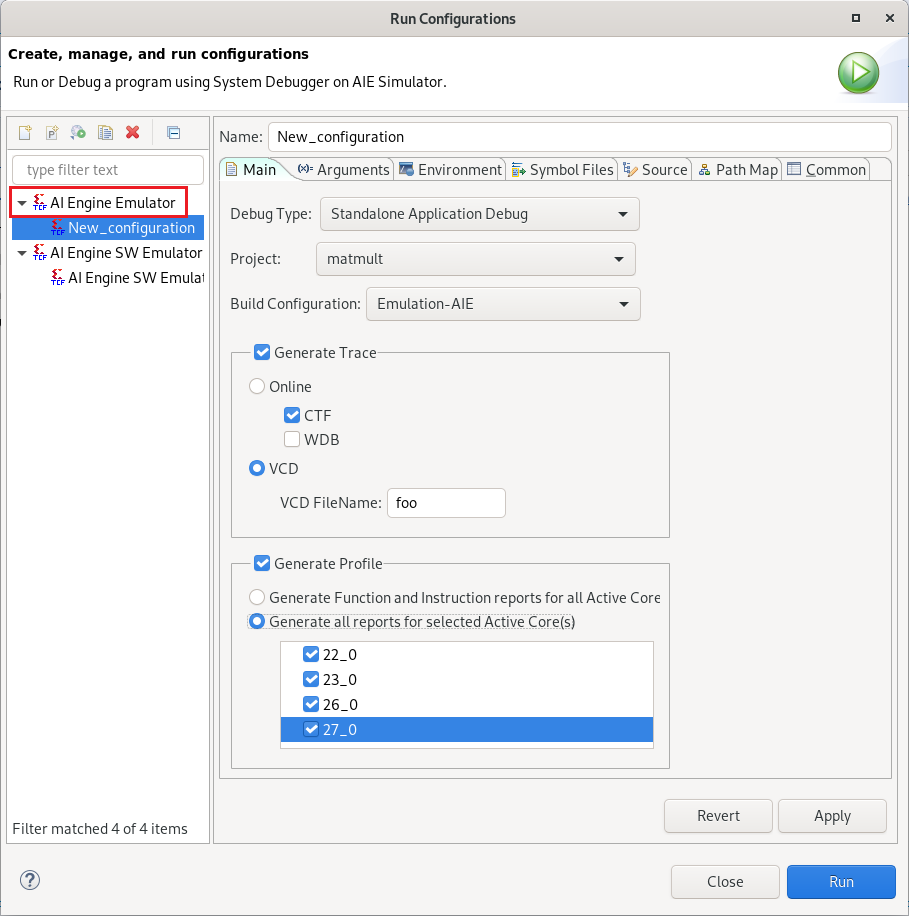
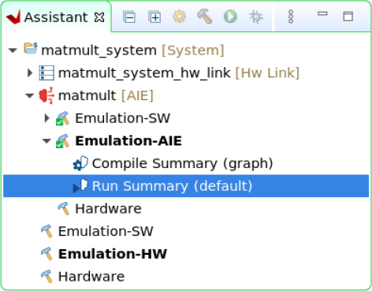
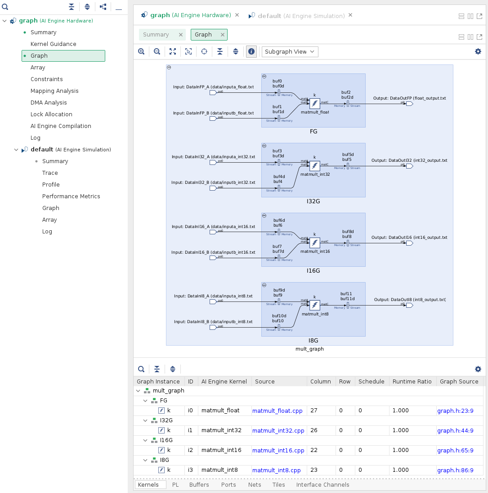
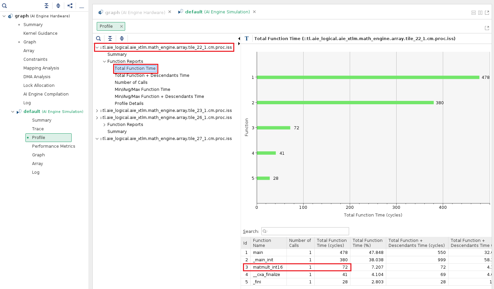
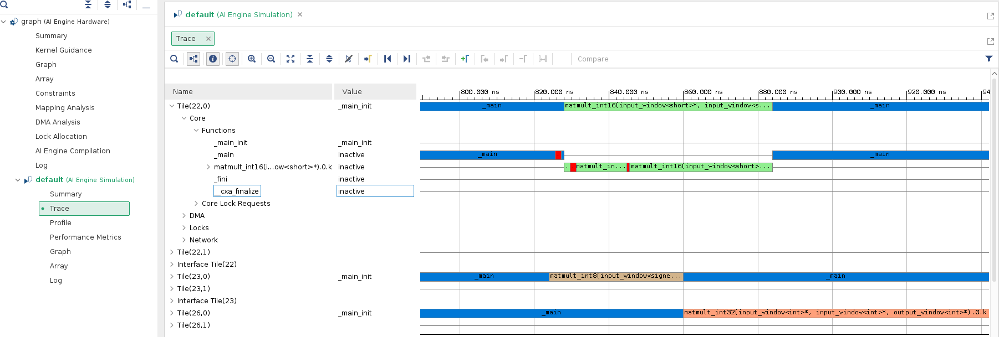
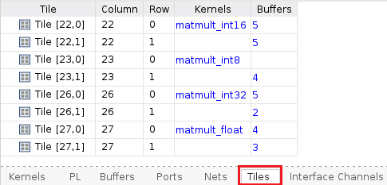
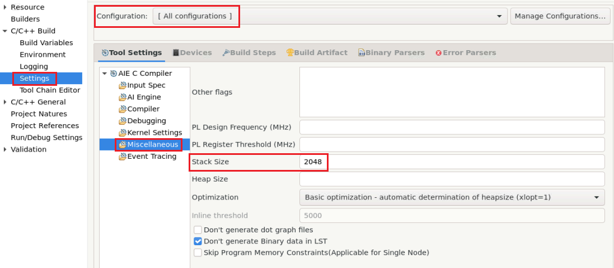
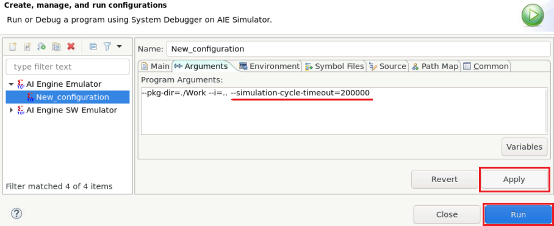

# Matrix Multiplication lab

## Introduction

This lab guides you through the steps involved in creating an AIE Graph that supports Matrix Multiplication for different data types.

## Description of the lab

In this lab, you will add four different AIE kernels, each of them supporting a different data type to compute a Matrix Matrix multiplication of dimension 16x8 and 8x8. The supported data types are: float, int32, int16 and int8. Each kernel is written to fully utilize the vector processor data path.

## Steps

### Create a Vitis Project for the VCK5000 Versal Development Card

1. Verify that the tools and VCK5000 platform are setup correctly [here](setup_tools.md#verifying-tools-installation)

1. If you are not in the Vitis IDE already, start the Vitis IDE by running

   ```sh
   vitis -workspace ~/xup_aie_workspace
   ```

   Note, Vitis will use `~/xup_aie_workspace` as work directory

1. In the Vitis GUI create a new application project

   * Platform: xilinx_vck5000_gen4x8_xdma_2_202210_1
   * Name: matmult
   * Processor: ai_engine
   * Domain: aie_domain
   * Acceleration templates: Empty Application

### Add source code for the AI Engine domain

1. In the Explore pane, right-click `matmult [ aie_domain ]`, then select *Import Sources...*

1. In the Import Source window, click *Browse...*, then navigate to `$HOME/xup_aie_training/sources/matmult_lab/aie` and click *Open*.

1. Tick the *aie* box, then update the field *Into folder:* **matmult**

1. In the Explore pane, expand `matmult [ aie_domain ] > data` and `matmult [ aie_domain ] > src`

   Review the source files. A detailed description of the files can be found [here](matmult_explained.md)

1. In the Explore pane, double-click `matmult [ aie_domain ] > matmult.prj`

1. In the Application Project Settings window, select the *Top-Level File*

1. In the File selection window, expand `matmult > src` and select **graph.cpp**, then click *OK*

### Compile AI Engine kernel for Software Emulation

We are going to compile the AI Engine kernel and run software emulation to verify code correctness.

1. In the Application Project Settings window, set the active build configuration *Emulation-SW*

1. In the Explore pane, right-click on `matmult [ aie_domain ]` and then select *Build Project*

### Run SW Emulation - x86 Simulation

Software emulation (x86 Simulation) uses the files in the data folder as stimuli. We will get an output file with the results.

1. In the Explore pane, right-click on `matmult [ aie_domain ]` and then select *Run As > Launch SW Emulator*.

1. Once the simulation is completed, in the Explore pane, select at the same time both `matmult [ aie_domain ] > data > ref_outputc_float.txt` and `matmult [ aie_domain ] > Emulation-SW > x86simulator_output > float_output.txt`. Then, right-click on one of them and select *Compare With > Each Other After Transformation*

1. In the *Extra transformation commands* window, enter the following command to remove timestamps and to remove the extra spaces, then click *OK*

   ```console
   grep -v T {0} | sed "s/^[ \t]*//"  | sed "s/[ ^t]*$//" > {0}2 && mv {0}2 {0}
   ```

1. A windows reporting no differences will appear

   You can perform the same comparison for the other 3 data types

### Compile and run AIE Simulation

This is still a software emulation (AIE Simulation), however the simulation takes into account the actual AI Engine array architecture. The AIE Simulation also uses files as input/outputs.

1. In the Application Project Settings window, set the active build configuration *Emulation-AIE*

1. In the Explore pane, right-click on `matmult [ aie_domain ]` and then select *Build Project*

   This compilation takes around 3-4 minutes

1. In the Explore pane, right-click on `matmult [ aie_domain ]` and then select *Run As > Run Configurations...*

   

1. Double-click on the AI Engine Emulator. This will create a new run configuration

1. Select: Generate Trace, Generate Profile, Generate all reports for selected Active Cores(s) and tick all cores.

   

1. Click `Apply` and then `Run`

   The emulation takes around 4-5 minutes

1. In the Explore pane, select at the same time both `matmult [ aie_domain ] > data > ref_outputc_float.txt` and `matmult [ aie_domain ] > Emulation-AIE > aiesimulator_output > float_output.txt`. Then, right-click on one of them and select *Compare With > Each Other After Transformation*

1. In the *Extra transformation commands* window, enter the following command to remove timestamps and to remove the extra spaces, then click *OK*

   ```console
   grep -v T {0} | sed "s/^[ \t]*//"  | sed "s/[ ^t]*$//" > {0}2 && mv {0}2 {0}
   ```

1. A windows reporting no differences will appear

   You can perform the same comparison for the other 3 data types

### Explore AIE Graph with Vitis Analyzer

1. In the Assistant pane, double-click `matmult_system [System] > matmult [AIE] > Emulation-AIE > Run Summary (default)`

   

1. In the Vitis Analyzer open the `Graph` tab

1. Note that there are 4 subgraphs, one for each data type

   

1. Questions for the reader

   Q1: How many AI Engine tiles are used? Where are they placed?

   Q2: How many buffers are used? Where are they placed? What is their size?

   Q3: Is any AI Engine tiles only used for its memory?

   Q4: What is the AI Engine Frequency?

   Q5: How many tiles are used for Buffers?

   Q6: How many Interface channels are used for the ADF Input/Output?

   Answers in the [appendix](#appendix)

1. Recommended exploration for curious readers

   E1: Explore the `Profile` tab to find out more execution information in each AI Engine tile
<!-- AI Engine names still show math_engine -->

   E2: Explore the Intermediate Representation of the code for each AI Engine tile. In Vitis, open the file `Emulation-AIE > Work > aie > ir > 22_0.ll`

   E3: Explore the assembly code for each AI Engine tile. In Vitis, open the file `Emulation-AIE > Work > aie > 22_0 > Release > 22_0.lst`

## Performance Metrics

If we analyze the AI Engine Simulation Tab in Vitis Analyzer, you can find Profile information for each AI Engine tile

1. Check the Total Function Time for Tile (22,1)

   

   As you can see the matmult_int16 kernel takes 72 cycles to complete

   Q7: How many cycles are spend on float, int32 and int8?

1. You can open the Trace, this reports all of the activity for the selected AI Engine Tiles

   

   Note that for the matmult_int16 kernels there memory stalls (in red), but these are minimal. You can also explore the activity for the other Tiles.

The Profile and Trace will help you analyze the activity on your AIE kernel code, find bottlenecks, memory stalls, etc. These reports are key in helping you achieving maximum performance.

## Change Runtime Ratio

1. Open the `graph.h` file and change the runtime ratio for I16G and I8G, line 104 and 105, to 45.

   ```c++
   MatMultInt16Graph<45> I16G;
   MatMultInt8Graph<45> I8G;
   ```

1. Recompile aie_domain

1. Open the Compiled Summary

   If you explore the Array tab, you can see that `matmult_int16` and `matmult_int8` kernels are now mapped to the Tile (22,1). This means that we only use 3 tiles for the kernels and 8 for the buffers, based on the summary information.

1. Recommended exploration for curious readers

   Change the runtime ratio of all kernels to 24.
   How many Tiles are used for the Kernels?
   How many Tiles are used for buffers?

## Assignments for the Reader

The following assignments are optional, however they will help deepen your knowledge about the AIE programming model. No solution is provided for these assignments.

1. Implement a matrix multiplication kernel with mixed precision for mat A and mat B.

   For instance, mat A is `int16` and matB `int8` or vice versa. You can also consider `int32` and `int16`. Refer to AIE API Matrix Multiply documentation to find out [supported shapes](https://www.xilinx.com/htmldocs/xilinx2022_2/aiengine_api/aie_api/doc/group__group__mmul.html#group_mmul_page_supported_shapes)

1. Using the existing kernels compute the result of a bigger matrix multiplication

   For instance a Matrix Multiplication where A is 64x64 and B is 64x64. You can go one step further and use the cascade interface to further partition the multiplication between different Tiles

It is recommended that you increase the [stack size](#stack-size) and the [simulation cycle timeout](#simulation-cycle-timeout)

If you are attending an in-person tutorial, you can request support from your instructor. Otherwise, open a [GitHub issue](https://github.com/Xilinx/xup_aie_training/issues/new/choose)

## Build Hardware

Coming soon

<!--
To build for hardware we recommend using the command line, the process is fully automated with Makefile, there is one Makefile for each domain, namely: aie, pl and host. On top of this, there is a global Makefile that will generate the final xclbin file and host code.

To build the hardware and host code, run

```
cd $HOME/xup_aie_training/sources/matmult_lab/
make
```

The build process takes around 200 minutes, for a machine with 8 cores.

You can check the commands that are executed by running `make -n`

## Run on the VCK5000

Once the hardware is built, you can run the matrix multiplication lab on the VCK5000 by executing:

```
cd $HOME/xup_aie_training/sources/matmult_lab/host/
./matmult.exe ../build.hw/matmult.xclbin
```
-->
## Appendix

### Answers

Q1: Four AI Engines are used

| ID | Kernel             | Column | Row |
|----|--------------------|--------|-----|
| i0 | matmult_float      | 27     | 0   |
| i1 | matmult_int32      | 26     | 0   |
| i2 | matmult_int16      | 22     | 0   |
| i3 | matmult_int8       | 23     | 0   |

Q2: Three double buffers for each kernel are used, twelve double buffers in total

| ID    | Column | Row | Bank(s) | Size |
|-------|--------|-----|---------|------|
| buf0  | 27     | 1   | 2       | 512  |
| buf1  | 27     | 0   | 2       | 256  |
| buf2  | 27     | 0   | 1       | 512  |
| buf3  | 26     | 0   | 0       | 512  |
| buf4  | 26     | 1   | 0       | 256  |
| buf5  | 26     | 0   | 1       | 512  |
| buf6  | 22     | 1   | 2       | 256  |
| buf7  | 22     | 0   | 0       | 128  |
| buf8  | 22     | 1   | 2       | 256  |
| buf9  | 23     | 1   | 0       | 128  |
| buf10 | 22     | 0   | 2       |  64  |
| buf11 | 23     | 1   | 2       | 128  |

Q3: Yes, based on the Tiles tab, you can see that AI Engine tile (27,1), (26,1), (23,1) and (22,1) are used only for its memory.

   

Q4: **1250 MHz**. Find this in Summary tab within the Vitis Analyzer, AI ENGINE FREQUENCY

Q5: **Seven**. Find this in Summary tab within the Vitis Analyzer, AI ENGINE RESOURCE Utilization. Note that Tile (23,0) is not used to allocate memory

Q6: **Twelve**. Find this in Summary tab within the Vitis Analyzer, AI ENGINE RESOURCE Utilization

Q7:

| data type  | Cycles |
|------------|--------|
| float      | 347    |
| int32      | 224    |
| int16      | 72     |
| int8       | 37     |

### Increase Stack

1. Right-click `matmult [ aie_domain ]`, then select *C/C++ Build Settings*

   

1. In the Properties for matmult windows, under *C/C++ Build* select `Settings`, then make sure you select `[All configurations]`

1. Under *AIE C Compiler* select *Miscellaneous* and set the `Stack Size` to 2048

   

1. Click *Apply and Close*

1. Compile AIE code

### Increase Simulation Cycle Timeout

1. In the Explore pane, right-click on `matmult [ aie_domain ]` and then select *Run As > Run Configurations...*

   

1. Select *Arguments* and add `--simulation-cycle-timeout=200000`

   

1. Click `Apply` and then `Run`

   The emulation takes around 4-5 minutes

---------------------------------------
<p align="center">Copyright&copy; 2023 Advanced Micro Devices</p>