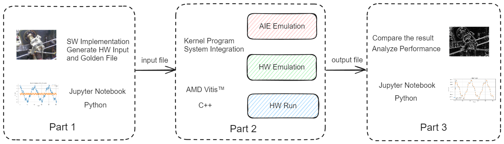

# Project-Based Learning on Adaptive SoC

## Goal

 A simple, clear and intuitive learning process with a specific application focus

The project-based learning focus is twofold:

* Firstly, design a real application. We will generate stimuli data and feed into the AIE for computation. This allows us for the intuitive validation and comparison of AIE computation results within a practical context.

* Secondly, learn the AIE programming model by doing. The labs aim at providing thorough and detailed explanation of AIE kernel programming model. Empowering developers with practical kernel development skills and a deep understanding of the AIE's vector processor architecture, maximizing the parallel computing performance of the graph level dataflow architecture.

## Objective

| Programming Model | Application                                               |
| ----------------- | --------------------------------------------------------- |
| Single Kernel     | [Low-Pass Filter](./fir_single_kernel.md) |
| Multiple Kernel   | [Mean Filter](./fir_multi_kernel.md) |

## Introduction

All the labs in this PBL tutorial is divided into three parts. The first part shows the whole process of designing an application and verifying it using Python. The second part focus on the kernel programming using the AIE APIs to achieve the highest performance on the AI Engine. The primary goal of the part two is to ensure the use of the vector processor and to understand the theoretical maximum. Vectorization of the algorithm is important, but managing the vector registers, memory access, and software pipelining are also paramount. The third part goes through the steps on creating the Adaptive DataFlow (ADF) graph and analyze the performance. The following table shows the key content of the three parts of the tutorial.

<table border="2">
<thead>
  <tr>
    <th>Part</th>
    <th>Topic</th>
    <th>Description</th>
    <th>Environment</th>
  </tr>
</thead>
<tbody>
  <tr>
    <td rowspan="3">1</td>
    <td rowspan="3"><a href="https://github.com/Xilinx/xup_aie_training/blob/main/pbl/aie_single_kernel/fir_lowpass/notebook/fir_lowpass1.ipynb">Software implementation</a></td>
    <td>Demonstrate the software implementation of the application</td>
    <td rowspan="3">Jupyter Notebook</td>
  </tr>
  <tr>
    <td>Using Python and its powerful extensible library</td>
  </tr>
  <tr>
    <td>Generate the input and golden data files for the AIE</td>
  </tr>
  <tr>
    <td rowspan="2">2</td>
    <td rowspan="2"><a href="https://github.com/Xilinx/xup_aie_training/blob/main/pbl/aie_single_kernel/fir_lowpass/notebook/fir_lowpass2.ipynb">Single Kernel Programming</a></td>
    <td>Design the FIR single kernel in AIE</td>
    <td rowspan="2">AMD Vitis 2022.2</td>
  </tr>
  <tr>
    <td>Analyze and optimize the read and write efficiency of ports</td>
  </tr>
  <tr>
    <td rowspan="3">3</td>
    <td rowspan="3"><a href="https://github.com/Xilinx/xup_aie_training/blob/main/pbl/aie_single_kernel/fir_lowpass/notebook/fir_lowpass3.ipynb">Graph Programming and Performance Analysis</a></td>
    <td>Create the kernel Graph and the test bench</td>
    <td rowspan="3">Jupyter Notebook</td>
  </tr>
  <tr>
    <td>Compare with AIE HW Emulation result with the SW result</td>
  </tr>
  <tr>
    <td>Analyze performance and accuracy</td>
  </tr>
</tbody>
</table>

The following images visually illustrate the process of the PBL experiment, starting from Part one where applications are showcased in a Jupyter notebook, progressing to Part 2 where kernel code is compiled and simulated or tested on the board using the Vitis tool, and finally advancing to Part 3 where simulation or on-board test results are exported and imported back into the Jupyter notebook for performance simulation and verification



## Environment Setup

1. Install Jupyter Lab on Windows system

  ```sh
  pip install jupyterlab
  ```

1. Set up the Python environment with the necessary packages

  ```sh
  cd $HOME/pbl/common
  pip install -r requirements.txt
  ```

1. Open the Jupyter Notebook

  ```sh
  cd $HOME/pbl/aie_single_kernel/fir_lowpass/notebook
  py -m jupyter lab
  ```

1. Install the Vitis tool and setup VCK5000 in Linux system

   * If you want to set up a local environment for VCK5000，please refer to this [Guide](./setup_local_computer.md).

---

<p align="center">Copyright© 2023 Advanced Micro Devices</p>
