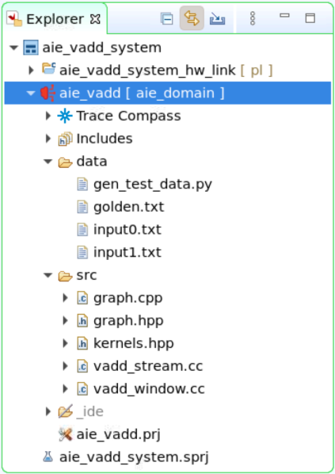
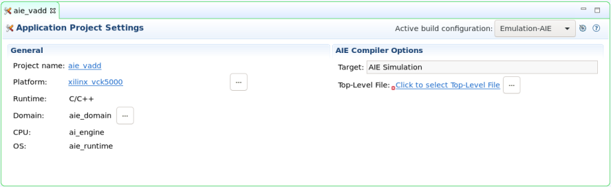
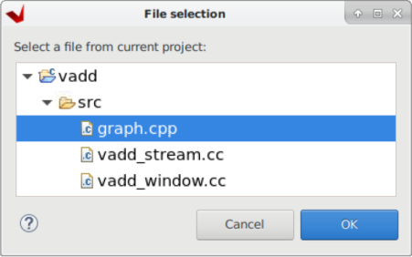

# Vector Add lab

## Introduction

This lab guides you through the steps involved in creating your first Vitis project targeting both the AI Engine and the Adaptable Engine. You will be implementing a very simple adder kernel in the AI Engine and a few datamovers on the Adaptable Engine. You will simulate and emulate the project. Finally, you will run the lab on real hardware.

### References

For more details on the Vitis IDE check out [Creating a Vitis IDE Project](https://docs.xilinx.com/r/en-US/ug1393-vitis-application-acceleration/Creating-a-Vitis-IDE-Project).

* [Compiling AI Engine Graph Applications](https://docs.xilinx.com/r/en-US/ug1393-vitis-application-acceleration/Compiling-AI-Engine-Graph-Applications)

## Description of the lab

This lab uses an adder kernel on the AI Engine and three datamovers on the Adaptable Engine (PL), the lab also uses a host code to control the lab.

Concepts

* The source code is written on C++

* Linking file

* Run AI Engine x86 simulation

* Run AI Engine simulation

## Objectives of this lab

After completing this lab, you will learn to:

* Create a project using the Vitis GUI

* Run AI Engine software simulation

* Run AI Engine software emulation

* Linking kernels between Adaptable and AI Engines

* Run hardware

## Steps

Your journey with Versal devices begins here, buckle up!

### Clone repo

Follow these steps to get the source code for this tutorial, [Get Source Code](setup_tools.md#get-source-code)

### Create a Vitis Project for the VCK5000 Versal Development Card

1. Verify that the tools and VCK5000 platform are setup correctly [here](setup_tools.md#verifying-tools-installation)

1. In a terminal, start the Vitis IDE by running

   ```sh
   vitis -workspace ~/xup_aie_workspace
   ```

   Note, Vitis will use `~/xup_aie_workspace` as work directory

1. The Vitis IDE Welcome page is displayed

   

1. Create a new application project

   Click *Create Application Project* from Welcome page, or *File > New > Application Project* to create a new application

1. Click *Next >* in the first window

   

1. Select `xilinx_vck5000_gen4x8_qdma_2_202220_1` platform and click *Next >*

   If you do not see this platform, check you followed the lab set up instructions to set the `PLATFORM_REPO_PATHS` variable.

   

1. Name the project `aie_vadd`, and select the ai_engine domain then click *Next >*

   

1. Confirm that the domain is aie_domain then click *Next >*

   

1. Select *Empty Application* in the Templates window and click *Finish*

   

1. Review the Vitis IDE.

   

   * The Explorer view: displays a file-oriented tree view of the project folders and their associated files

   * The Assistant view: central location to view and manage the projects within the workspace. You can interact with the project settings and reports

   * Project Editor view: displays the current project, the target platform, the active build configuration and specified hardware functions. It also allows you to edit the project settings

   * Console view, presents multiple views including the command console, design guidance, project properties, logs and terminal views

   For more information about the Vitis IDE check out the [documentation](https://docs.xilinx.com/r/en-US/ug1393-vitis-application-acceleration/Understanding-the-Vitis-IDE)

### Add source code for the AI Engine domain

1. In the Explore pane, right-click `aie_vadd [ aie_domain ]`, then select *Import Sources...*

   

1. In the Import Source window, click *Browse...*, then navigate to `$HOME/xup_aie_training/sources/vadd_lab/aie` and click *Open*.

1. Tick the *aie* box

1. Update the field *Into folder:* **aie_vadd**

   

1. In the Explore pane, expand `aie_vadd [ aie_domain ] > data` and `aie_vadd [ aie_domain ] > src`

   Review the source files, you can find a detailed description of the source code [here](vadd_explained.md)

   

1. In the Explore pane, double-click `aie_vadd [ aie_domain ] > aie_vadd.prj`

   The Application Project Settings window will open

   

1. In the Application Project Settings window, select the *Top-Level File*

   

1. In the File selection window, expand `aie_vadd [ aie_domain ] > src` and select **graph.cpp**, then click *OK*

   

   This top level file defines the testbench used for simulation.

### Compile AI Engine kernel for Software Emulation

We are going to compile the AI Engine kernel and run software emulation to verify code correctness.

1. In the Application Project Settings window, set the active build configuration *Emulation-SW*

   

1. In the Explore pane, right-click on `aie_vadd [ aie_domain ]` and then select *Build Project*

   

### Run SW Emulation - x86 Simulation

Software emulation (x86 Simulation) uses the files in the data folder as stimuli. We will get an output file with the results.

1. In the Explore pane, right-click on `aie_vadd [ aie_domain ]` and then select *Run As > Launch SW Emulator*

   

1. The Console will show the following message.

   ```console
   x86simulator --pkg-dir=./Work --i=.. 
   INFO: Reading options file './Work/options/x86sim.options'.
   AI Engine results match golden result
   Simulation completed successfully returning zero
   ```

1. In the Explore pane, select at the same time both `aie_vadd [ aie_domain ] > Emulation-SW > x86simulator_output > output.txt` and `aie_vadd [ aie_domain ] > data > golden.txt`. Then, right-click on one of them and select *Compare With > Each Other After Transformation*

   

1. In the *Extra transformation commands* window, enter the following command to remove timestamps and to remove the extra spaces, then click *OK*

   ```console
   grep -v T {0} | sed "s/^[ \t]*//"  | sed "s/[ ^t]*$//" > {0}2 && mv {0}2 {0}
   ```

   

1. A window reporting no differences pops up, click *OK* to continue

   

### Compile and run AIE Simulation

This is still a software emulation (AIE Simulation), however the simulation takes into account the actual AI Engine array architecture. The AIE Simulation also uses files as input/outputs.

1. In the Application Project Settings window, set the active build configuration *Emulation-AIE*

   

1. In the Explore pane, right-click on `aie_vadd [ aie_domain ]` and then select *Build Project*

   

   This compilation takes around 3-4 minutes

1. In the Explore pane, right-click on `aie_vadd [ aie_domain ]` and then select *Run As > Launch AIE Emulator*

   

   The simulation takes around 4-5 minutes

1. In the Explore pane, select at the same time both `aie_vadd [ aie_domain ] > Emulation-AIE > aiesimulator_output > output.txt` and `aie_vadd [ aie_domain ] > data > golden.txt`. Then, right-click on one of them and select *Compare With > Each Other After Transformation*

   

1. In the *Extra transformation commands* window, enter the following command to remove timestamps and to remove the extra spaces, then click *OK*

   ```console
   grep -v T {0} | sed "s/^[ \t]*//"  | sed "s/[ ^t]*$//" > {0}2 && mv {0}2 {0}
   ```

   

1. A window reporting no differences pops up, click *OK* to finish

   

## Assignments for the Reader

The following assignments are optional, however they will help deepen your knowledge about the AIE programming model. No solution is provided for these assignments.

1. By default the graph instantiates the `vadd_stream` kernel. However, you can also instantiate the `vadd_window` kernel by commenting line 11. Comment line 11, recompile the graph and rerun the AIE. What differences do you notice in the graph?

1. Make the necessary changes to include both `vadd_stream` and `vadd_window` kernels in the `simpleGraph`

   Note that the text files used as stimuli cannot be reused

1. Change the plio bitwidth in the `input_plio::create()` to either `plio_64_bits` or `plio_128_bits`. What changes do you notice? Is it necessary to make any other changes?

   Note that the text files used as stimuli need to be regenerated to match the plio bitwidth, the `write_file` function on the Python file supports this

1. 

If you are attending an in-person tutorial, you can request support from your instructor. Otherwise, open a [GitHub issue](https://github.com/Xilinx/xup_aie_training/issues/new/choose)

## Conclusion

In this lab, you used Vitis to create a vector add running on the AI Engine. You ran both x86 and AIE simulation.

---------------------------------------
<p align="center">Copyright&copy; 2023 Advanced Micro Devices</p>
