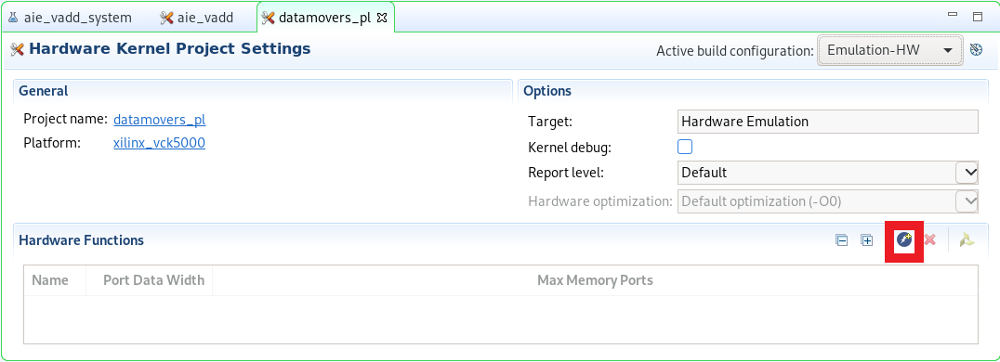
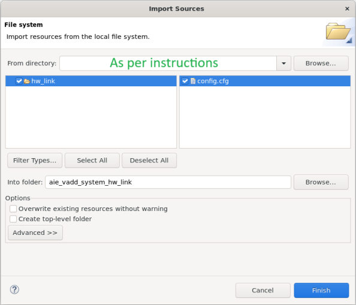
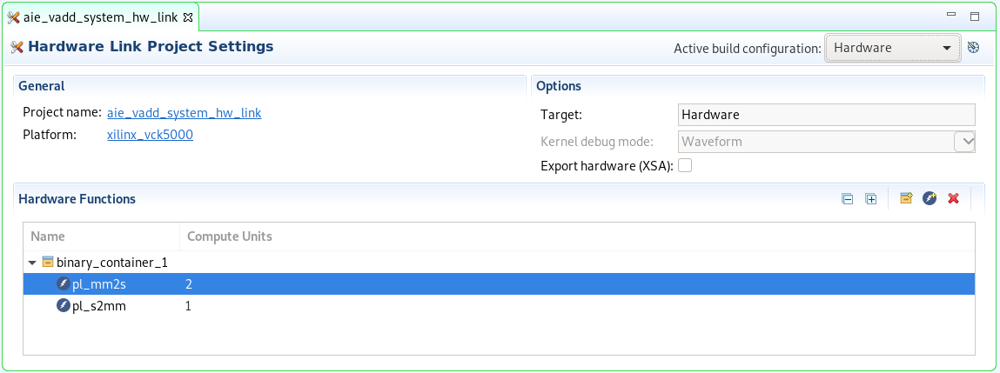
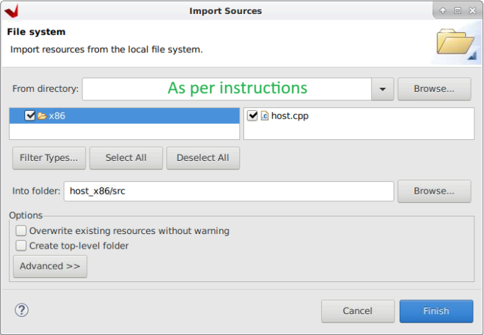
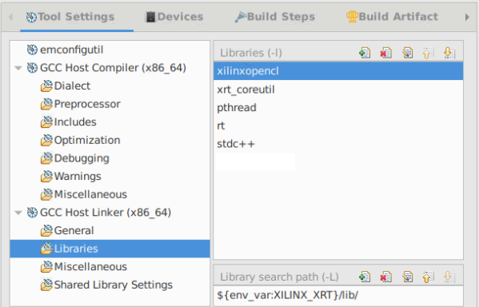
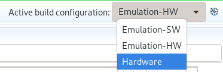

# Vector Add lab, part 2

## Introduction

The second part of this lab guides you through the steps involved in creating both the PL and x86 domain and to run the code in real hardware.

### References

Below you can find a list of comprehensive documentation related to the steps we are going to carry out in this lab.

* [Vitis Application Development Flow](https://docs.xilinx.com/r/en-US/ug1393-vitis-application-acceleration/Vitis-Application-Development-Flow)

* [Building the Software Application](https://docs.xilinx.com/r/en-US/ug1393-vitis-application-acceleration/Building-the-Software-Application)

* [Building the Device Binary](https://docs.xilinx.com/r/en-US/ug1393-vitis-application-acceleration/Building-the-Device-Binary)

* [Linking the Kernels](https://docs.xilinx.com/r/en-US/ug1393-vitis-application-acceleration/Linking-the-Kernels)

* [Specifying Streaming Connections](https://docs.xilinx.com/r/en-US/ug1393-vitis-application-acceleration/Specifying-Streaming-Connections)

* [Packaging the System: Packaging for Data Center Platforms](https://docs.xilinx.com/r/en-US/ug1393-vitis-application-acceleration/Packaging-for-Data-Center-Platforms)

* [Building-and-Running-the-Application](https://docs.xilinx.com/r/en-US/ug1393-vitis-application-acceleration/Building-and-Running-the-Application)

## Description of the lab

This lab uses an adder kernel on the AI Engine and three datamovers on the Adaptable Engine (PL), the lab also uses a host code running on the x86 to control these kernels.

Concepts

* PL and x86 domain

* Linking file

* HW emulation

* Implement and run on hardware

## Steps

### Add Hw Kernel Project

1. In the Explore pane, right-click `aie_vadd_system` and select *Add Hw Kernel Project...*

   

1. In the New Vitis IDE Project window, enter `datamovers_pl` as *Hw Kernel project name:*, then click *Finish*

   

1. Right-click on the new created `datamovers_pl > src` folder, then select `Import Sources...`

   

1. In the Import Source window, click *Browse...*, then navigate to `$HOME/xup_aie_training/sources/vadd_lab/pl` and click *Open*.

1. Tick the *pl* box, then update click *Finish*

   

1. In the Explore pane, double-click `datamovers_pl.prj`

   

1. In the Hardware Kernel Project Settings, click the `Add Hardware Function...` button

   

1. In the Add Hardware Function window, select both pl_mm2s and pl_s2mm and then click *OK*

   

   Notice how both kernels are added into the Hardware Function box

### Add kernel linking file

We need to specify how the streaming interfaces of our kernels are going to be connected to the AI Engine array.

1. In the Explore pane, right-click on `aie_vadd_system_hw_link`, then select *Import Sources...*

   

1. In the Import Source window, click *Browse...*, then navigate to `$HOME/xup_aie_training/sources/vadd_lab/hw_link` and click *Open*.

1. Tick the *hw_link* box

1. Enter **aie_vadd_system_hw_link/** in the *Into folder:* field, then click *Finish*

   

1. In the Explore pane, double-click `aie_vadd_system_hw_link > aie_vadd_system_hw_link.prj`

   

1. In the Hardware Link Project Settings, increase the pl_mm2s compute units to 2

   

1. Right-click on the binary_container_1, , and select *Edit V++ Options...*

   

1. In the `V++ command line options`: add `--config ../config.cfg` then click *Apply and Close*

   

### Add host code

1. In the Explore pane, right-click `aie_vadd_system` and select *Add Application Project...*

   

1. In the New Vitis IDE Project window, enter `host_x86` as *Application project name:*, select the x86 SMP processor and finally click *Next >*

   

1. In the Template window, select `Empty Application` then click *Next >*

   

1. In the Explore pane, right-click on `host_x86`, then select *Import Sources...*

   

1. In the Import Source window, click *Browse...*, then navigate to `$HOME/xup_aie_training/sources/vadd_lab/host` and click *Open*.

1. Tick the *host* box, then click *Finish*

   

### Configure x86 compilation

<!-- Based on the lab System Design Flow, AIE course 2. 
Steps on adding the host application, page 30 onwards
-->

1. In the Explore pane, right-click on `host_x86 [x86]`, then select *C/C++ Build Settings...*

   

1. Select All configurations and add dialect flag, `-std=c++17`

   

<!--
1. Select `GCC Host Compiler (x_86_64) > Includes`, click `Add..`

   Add the `${env_var:XILINX_VITIS}/aietools/include/`

   
-->
1. Select `GCC Host Linker (x_86_64) > Libraries`

   Add the following libraries, under Libraries (-l)

   `xrt_coreutil`

   

1. Finally, click *Apply and Close*

<!--
### Compile and run project

In this section, we are going to run hardware emulation for the entire system

1. In the Explore pane, double-click on `aie_vadd_system.sprj`

   

1. In the System Project Settings, add the following line to the packaging options

   `--package.boot_mode=ospi`

   Also, make sure Emulation-HW is the active build configuration

   

1. Note, Emulation-HW build fails, build for actual hardware instead

   ```console
   ERROR: [v++ 60-2351] Option 'package.sd_file' is valid only when 'package.boot_mode' option is specified as 'sd'
   ERROR: [v++ 60-702] Failed to finish packaging
   ```

1. In the Explore pane, right-click on the `aie_vadd_system` then select *Build Project*

   

   This process takes around 45 minutes.
-->

### Implement for actual hardware

In this section, we are going to run the vector add in actual hardware

1. In the Explore pane, double-click on `aie_vadd_system.sprj`

   

1. Select Hardware as the active build configuration

   

1. In the Explore pane, right-click on the `aie_vadd_system` then select *Build Project*

   

   This process takes around 80 minutes.

1. In the Explore pane, right-click on `aie_vadd_system` and then select *Run As > Launch Hardware*

   

## Conclusion

In this lab, you used Vitis IDE to include the PL and x86 domains to get a complete system that can run on the VCK5000.

---------------------------------------
<p align="center">Copyright&copy; 2023 Advanced Micro Devices</p>
