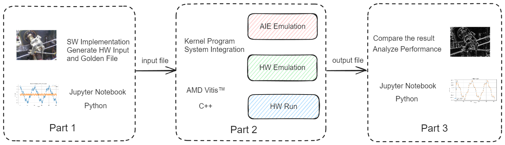

# Project-Based Learning on Adaptive SoC

## Goal：

 A simple, clear and intuitive learning process with a subject application background

The project-based learning has two main focuses:

* Firstly, to provide practical application contexts for experiments, where all input data is generated based on real-world applications and fed into the AIE for computation. This allows for the intuitive validation and comparison of AIE computation results within a practical context.
* Secondly, the lab aims to provide thorough and detailed explanations in AIE kernel programming, aiming to empower developers with practical kernel development skills and a deep understanding of the AIE's vector processor architecture, maximizing the parallel computing performance of the graph level dataflow architecture.

## Objective

| Programming Model | Application                                               |
| ----------------- | --------------------------------------------------------- |
| Single Kernel     | [Low-Pass Filter](./aie_single_kernel/fir_lowpass/readme.md) |
| Multipul Kernel   | [Mean Filter](./aie_multi_kernel/fir_interconnect/readme.md) |

## Introduction:

All the labs in this PBL tutorial is divided into three parts. The first part shows the whole process of designing an application and verifying it using Python. The second part focus on the kernel programming using the AIE APIs to achieve the highest performance on the AI Engine. The primary goal of the part two is to ensure the use of the vector processor approaches its theoretical maximum. Vectorization of the algorithm is important, but managing the vector registers, memory access, and software pipelining are also required. The third part goes through the steps on creating the ADF graph and analyze the performance. The following table shows the key content of the three parts of the tutorial.

| PART |                              TOPIC                              | SPECIFICATION                                               | Environment      |
| ---- | :-------------------------------------------------------------: | :---------------------------------------------------------- | ---------------- |
| 1    |          [Software Implementation](./fir_lowpass1.ipynb)          | Demonstrate the software implementation of the application  | Jupyter Lab      |
|      |                                                                | Using python language and the powerful extensible library   |                  |
|      |                                                                | Generate the input data and golden file for the AIE         |                  |
| 2    |           [AIE Kernel Programming](./fir_lowpass2.ipynb)           | Detailed explanation of AIE kernel programming              | AMD Vitis 2022.2 |
|      |                                                                | Analyze and optimize the read and write efficiency of ports |                  |
| 3    | [Graph Programming and Performance Analysis](./fir_lowpass3.ipynb) | Create the kernel Graph and the test bench                  | Jupyter Lab      |
|      |                                                                | Compare with AIE HW Emulation result with the SW result     |                  |
|      |                                                                | Analyze performance and accuracy                            |                  |

The following images visually illustrate the process of the PBL experiment, starting from Part one where applications are showcased in a Jupyter notebook, progressing to Part 2 where kernel code is compiled and simulated or tested on the board using the Vitis tool, and finally advancing to Part 3 where simulation or on-board test results are exported and imported back into the Jupyter notebook for performance simulation and verification



## Environment Setup:

1. Jupyter lab on Windows system:

* Install the Jupyter Lab and

  ```
  pip install jupyterlab
  ```
* Set up the Python environment with the necessary packages

  ```
  cd $HOME\pbl\common
  pip install -r requirements.txt
  ```
* Open the Jupyter Notebook

  ```
  cd $HOME\pbl\aie_single_kernel\fir_lowpass\notebook> py -m jupyter lab
  ```

2. Vitis tool installation and VCK5000 setup in Linux System:

* If you want to set up a local environment for VCK5000，please refer to this [Guide](../docs/setup_local_computer.md).

<p align="center">Copyright© 2023 Advanced Micro Devices</p>
